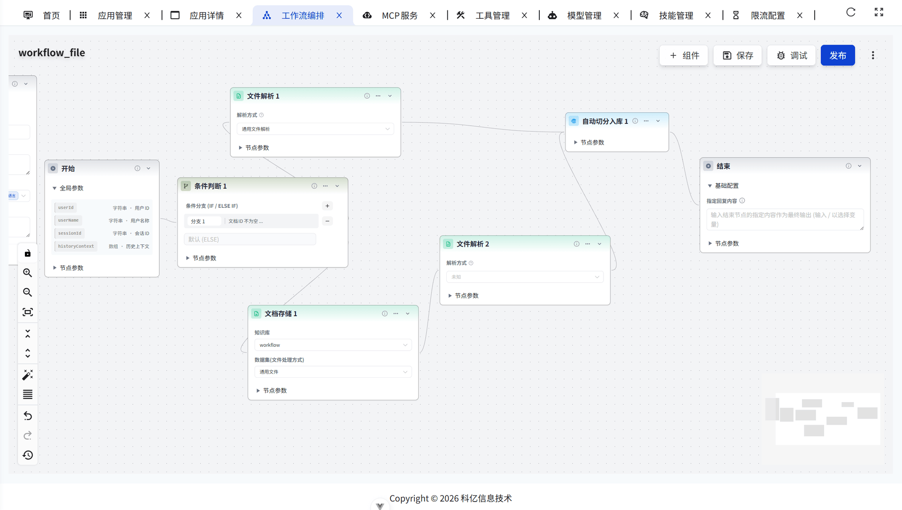
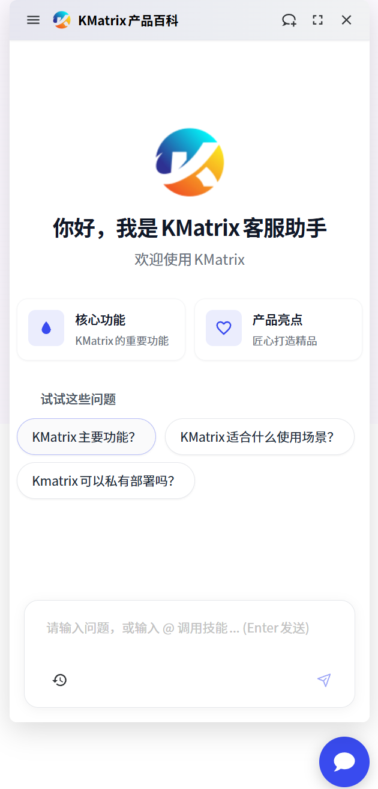

**KMatrix** 是**科亿知识库 (KYKMS)** 的全新设计版本，专注于将传统的文档管理与先进的 AI 技术深度融合。

在数字化时代，企业积累了海量非结构化数据，但往往难以有效利用。KMatrix 致力于解决这一痛点，通过 **RAG (检索增强生成)** 技术和 **可视化工作流编排**，将静态文档转化为动态知识服务。

KMatrix 不仅仅是一个文档存储库，更是一个 **AI Agent 孵化平台**。用户可以通过拖拽式的工作流设计器，轻松构建基于本地知识库的智能问答助手、客服机器人、文档分析专家或业务辅助机器人，也可以通过自然语言查询数据库以解决长尾业务需求。

kmatrix秉承易用至上的理念，提供 **开箱即用** 的体验，简单操作即可上手，一天至数天即可完成知识库的构建和AI对话App的打造，同时也提供高度自定义的灵活性，满足企业级应用的复杂需求。

--------------------------------------------------------------------------------

## 截图概览

## 最终用户对话

## 核心亮点

- **🚀 现代技术栈**: 后端基于 **Ruoyi-Vue-Plus** (Spring Boot 3 + JDK 17)，前端基于 **Soybean Admin** (Vue 3 + Vite + Naive UI)，紧跟技术潮流，性能卓越，开发体验极佳。
- **🧠 强大的 AI 引擎**: 深度集成 **LangChain4j** 和 **LangGraph4j**，提供 Java 领域最强的 AI 应用开发体验。
- **📊 增强型 RAG**:
    - 通过 **PostgreSQL + pgvector** 向量技术，实现余弦相似度检索，提供精准的自然语言问答能力。
    - 通过全文检索，支持 **GIN** 索引，实现关键字精准匹配和评分。
    - 支持混合检索，结合向量检索和全文检索，通过 **RRF** (Reciprocal Rank Fusion, 倒数排序融合) 算法，综合两种检索方式的优势，既实现了语义相似度检索的灵活，又兼顾了关键字检索的精准。
    - 采用 **BGE-Reranker** (交叉编码器) 进行重排序，进一步提升检索精度。
    - **父子分块** 策略，子分块匹配更加精准，减少噪音，同时返回父分块，提供更完整、连贯的上下文。
    - 支持QA对，为精准问题提供更有针对性的答案；同时支持为自然文件分块提供AI问题生成，自动获得QA对的效果。
    - 支持 PDF、Word、PPT、Xls、Markdown 等多种格式解析，支持手工调整分块内容。
- **⛓️ 可视化工作流 (Workflow)**: 内置基于 **Vue Flow** 的工作流编排引擎，支持节点拖拽、连线配置。用户可自定义 AI 处理流程 (如：知识检索 -> LLM 思考 -> 结果格式化)。
- **📍 无缝嵌入**: 拷贝一行脚本即可嵌入到第三方业务系统，让已有系统快速拥有智能问答能力。
- **🌍 模型中立**: 支持对接各种大模型，包括本地私有大模型 (DeepSeek R1 / Llama 3 / Qwen 2 等)、国内公共大模型 (通义千问 / 字节豆包 / 智谱 AI / Kimi 等) 和国外公共大模型 (OpenAI / Gemini 等)。
- **🧩 模块化设计**: 前后端完全分离。
    - **kmatrix-service**: 强大的后端服务，支持RBAC 权限。
    - **kmatrix-ui**: Monorepo 架构，包含管理端 (`@km/admin`) 和 嵌入式聊天窗口 (`@km/chat`)。
- **🎨 极致 UI 体验**: 使用 Naive UI 组件库，精心打磨的界面交互，支持暗黑模式、主题定制，提供类 Dify 的流畅编排体验。
- **🔐 安全可控**: 支持完全私有化部署，结合 Sa-Token 认证与精细化权限控制，确保企业知识资产安全。

--------------------------------------------------------------------------------

## 技术架构

### 后端 (kmatrix-service)
- **Spring Boot 3.2**: 核心框架。
- **LangChain4j / LangGraph4j**: AI 逻辑与工作流引擎。
- **PostgreSQL + pgvector**: 向量数据库支持。
- **MyBatis Plus**: 数据库持久层。
- **Sa-Token**: 鉴权与权限控制。
- **Redis**: 缓存与分布式锁。
- **Maven**: 项目管理。

### 前端 (kmatrix-ui)
- **Vue 3**: 核心框架。
- **Vite 5**: 构建工具。
- **TypeScript**: 静态类型检查。
- **Naive UI**: UI 组件库。
- **Vue Flow**: 工作流画布。
- **UnoCSS**: 原子化 CSS 引擎。
- **Pinia**: 状态管理。
