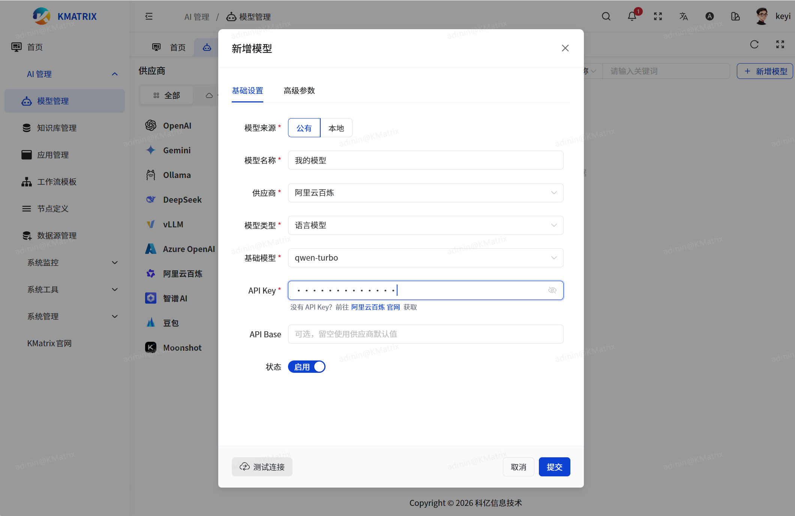
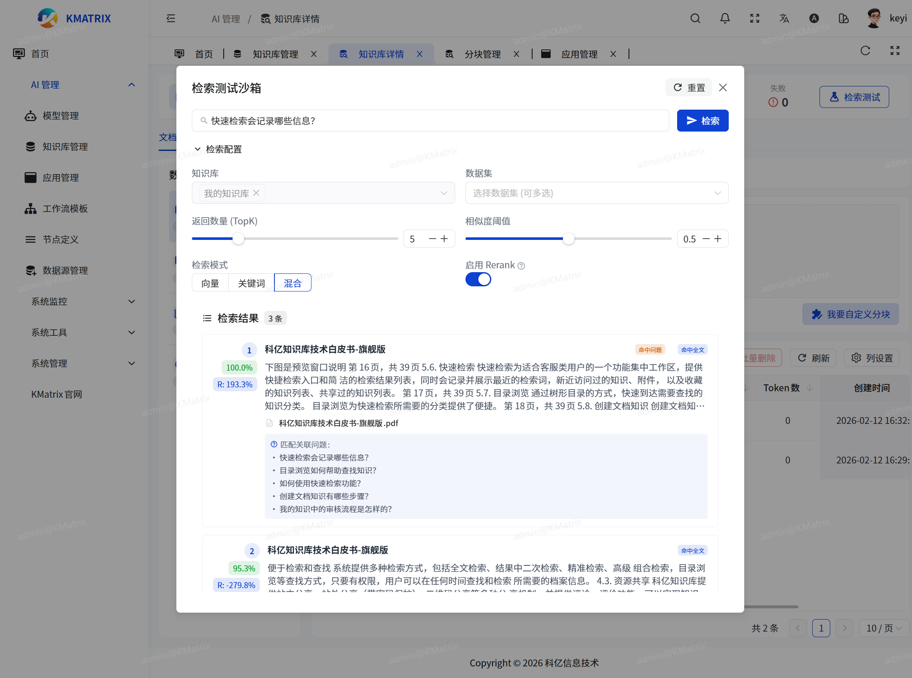
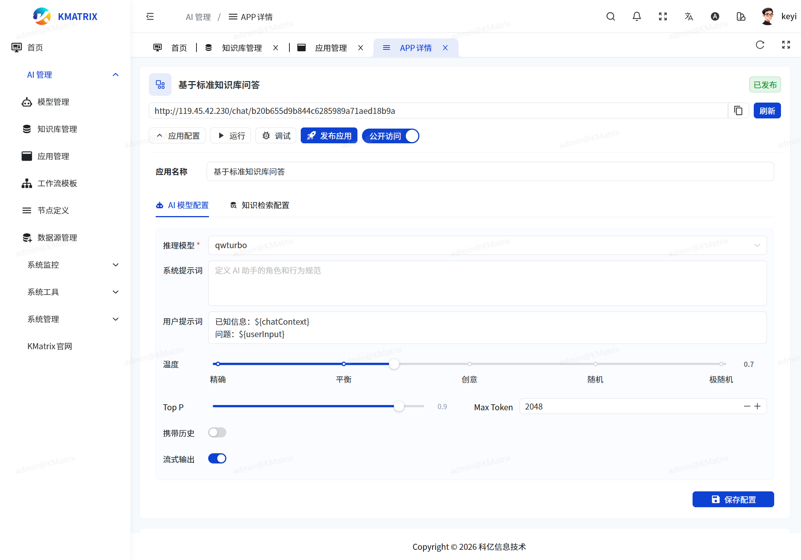
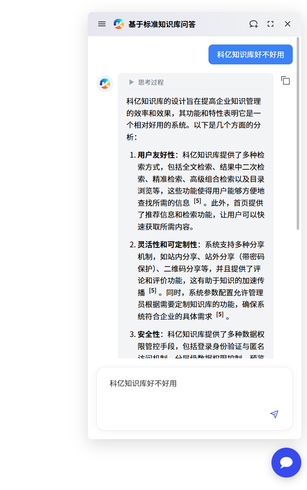

# KMatrix 快速部署与使用指南

本文档提供从容器一键部署到主体功能使用操作指引的完整流程。
如果你不想部署，也有[在线试用环境](http://kmatrix-admin.kykms.cn) (账密 test/666666 或 testadmin/admin123),  注：在线试用环境数据每天会重置，重要数据请注意留底。

---

## 1. 容器一键运行 (Deployment)

推荐使用 **自包含版 (Standalone)** 镜像，它内置了前端、后端和必要的配置，适合快速体验。

### 步骤

1.  打开 PowerShell (Windows)。
2.  进入项目根目录。
3.  执行以下命令一键启动：

```shell
docker run -d --name kmatrix-standalone -p 80:80 -v ~/kmatrix-data:/kmatrix-data registry.cn-guangzhou.aliyuncs.com/kyxxjs/kmatrix:latest
```

> **说明**:
> *   默认挂载当前目录下的 `kmatrix-data` 用于数据持久化（数据库、Redis、上传文件等）。
> *   启动后，服务将通过 **80 端口** 暴露。

### 访问

启动成功后，在浏览器访问：
*   **管理后台**: [http://localhost](http://localhost)
    登录账号密码:  admin/admin123

---

## 2. 主体功能使用流程 (Usage Flow)

登录管理后台后，请按照以下顺序配置和使用。

### 2.1 增加模型 (Add Model)

1.  进入 **模型管理 ** 菜单。
2.  点击 **"新建模型"**。
3.  配置模型信息：
    *   **模型名称**: 起一个易识别的名字（如 "我的模型"）。
    *   **模型类型**: 选择 "语言模型"。
    *   **厂商**: 选择对应厂商。
    *   **API Key**: 输入你的 API 密钥。
    *   **Base URL**: 如果是本地部署的大模型，输入模型服务的接口地址；云端大模型不需要输入。
4.  点击 **"保存"**(保存之前，可以先点击“测试连接”验证是否正常工作)。
    

### 2.2 增加知识库 (Add Knowledge Base)

1.  进入 **知识库管理 (Knowledge Manager)** 菜单。
2.  点击 **"新建知识库"**。
3.  输入 **知识库名称** 和 **描述**。
4.  点击 **"确定"** 创建。

### 2.3 上传文件 (Upload Files)

1.  在知识库列表中，点击刚创建的知识库，进入 **知识库详情**。
2.  选择“通用文件”数据集，点击 **"上传文档"**。
3.  **上传普通文件**:
    *   将 PDF, Word, Txt, MD 等文件拖入上传区域。
    *   点击 "开始上传" 并等待解析完成。
4.  **上传问答对 (QA)**:
    *   选择 "QA 拆分" 模式（如有）或上传 Excel/CSV 格式的问答对文件。
    *   解析完成后，系统会自动进行切片和向量化。
5.  **检索沙箱测试**:
    *   点击右上角的“检索测试”，输入与刚上传的文件内容有关的问题。
    *   点击检索，验证检索结果是否合理。
        

### 2.4 创建固定模板应用 (Create Fixed Template App)

1.  进入 **应用管理 (App Manager)** 菜单。
2.  点击右上角的 **"新建应用"** 按钮
3.  在下拉菜单中选择 **"从模板创建"**。
4.  在弹出的模板选择窗口中：
    *   浏览或搜索模板（如 "知识库对话助手"）。
    *   找到**"标准知识库问答"**，点击 **"使用此模板"**。
5.  输入 **应用名称**，点击 **"创建"**。
6.  系统会自动跳转到 **应用详情页**。

### 2.5 配置应用 (Configure App)

在应用详情页中，如果应用是"固定模板"类型，你会看到 **"应用配置" (App Config)** 面板（或点击 "应用配置" 按钮展开）。

#### AI 模型配置 (AI Model Config)
*   **推理模型**: 选择在 2.1 步骤中添加的语言模型 (必选)。
*   **系统提示词**: 定义 AI 的角色（例如："你是一个专业的文档助手..."）。
*   **用户提示词**:通常保持默认，或自定义变量 `\${chatContext}` 和 `\${userInput}`。
*   **参数设置**:
    *   **温度 (Temperature)**: 0 为精确，1 为创意。
    *   **Top P / Max Token**: 根据需求调整。
    *   **携带历史**: 开启后 AI 能记住上下文，建议设置 5-10 条。

#### 知识检索配置 (Knowledge Retrieval Config)
*   **知识库**: 选择在 2.2 步骤中创建的知识库 (必选，可多选)。
*   **检索模式**:
    *   `向量检索`: 基于语义匹配。
    *   `关键词检索`: 基于字面匹配。
    *   `混合检索` (推荐): 结合两者优势。
*   **Top K**: 每次召回的片段数量（默认 5）。
*   **相似度阈值**: 低于此分数的片段将被过滤（建议 0.5 - 0.7）。
*   **重排序 (Rerank)**: 开启可提高检索精准度。
*   **空结果回复**: 当没找到知识库内容时的默认回复。


点击底部的 **"保存配置"** 按钮。

### 2.6 调试对话 (Debug Chat)

1.  在应用详情页，点击操作栏中的 **"调试"** 按钮。
2.  在弹出的调试窗口中输入问题。
3.  观察 AI 的回复以及引用的知识库片段，验证配置效果。
4.  如效果不佳，关闭窗口调整 2.5 中的提示词或检索参数。

### 2.7 正式对话与发布 (Formal Chat)

1.  调试满意后，点击 **"发布应用"** 按钮。
2.  确认发布。
3.  发布成功后，点击 **"运行"** -> **"去对话"**。
4.  这将打开一个独立的聊天窗口，你可以像最终用户一样使用该应用。

---

## 3. 嵌入第三方站点 (Embed)

你可以将对话窗口嵌入到任何外部网站（如公司官网、个人博客）。

### 获取嵌入代码

1.  在应用详情页（需已发布），点击 **"运行"** 按钮侧边的下拉箭头（或直接点击操作栏）。
2.  选择 **"嵌入第三方"**。
3.  在弹窗中选择适合的模式并复制生成代码：

#### 方式 A: 全屏模式 (Fullscreen)
适合作为独立的聊天页面嵌入 (`iframe`)。
```html
<iframe
  src="http://你的域名/?appToken=your_token&appId=your_app_id"
  style="width: 100%; height: 100%;"
  frameborder="0"
  allow="microphone">
</iframe>
```

#### 方式 B: 浮窗模式 (Float) (推荐)
在网页右下角生成一个悬浮的气泡图标，点击展开对话框。
```html
<script
  async
  defer
  src="http://你的域名/loader.js?appToken=your_token&appId=your_app_id">
</script>
```

#### 方式 C: 移动端模式 (Mobile)
专为移动端优化的布局。

- ***浮窗嵌入效果，可以访问[科亿官网](http://www.kykms.cn)，右下角的聊天入口图标。***

### 创建空白 HTML 演示

如果你没有现成的网站，可以创建一个空白 HTML 文件来测试嵌入效果。


1.  在本地电脑创建一个名为 `test_chat.html` 的文件。
2.  粘贴以下代码（替换 URL 为你的实际地址）：

```html
<!DOCTYPE html>
<html lang="zh-CN">
<head>
    <meta charset="UTF-8">
    <meta name="viewport" content="width=device-width, initial-scale=1.0">
    <title>KMatrix Chat Demo</title>
    <style>
        body { margin: 0; padding: 0; background-color: #f0f2f5; font-family: sans-serif; }
        .container { display: flex; align-items: center; justify-content: center; height: 100vh; flex-direction: column; }
        h1 { color: #333; }
    </style>
</head>
<body>
    <div class="container">
        <h1>欢迎使用 KMatrix 智能助手</h1>
        <p>请点击右下角图标开始对话 ↘️</p>
    </div>

    <!-- 在此处粘贴 "浮窗模式" 的脚本代码 -->
    <script
      async
      defer
      src="http://localhost:9528/loader.js?appToken=你的TOKEN&appId=你的APPID">
    </script>
</body>
</html>
```
3.  双击打开该 HTML 文件即可体验。


