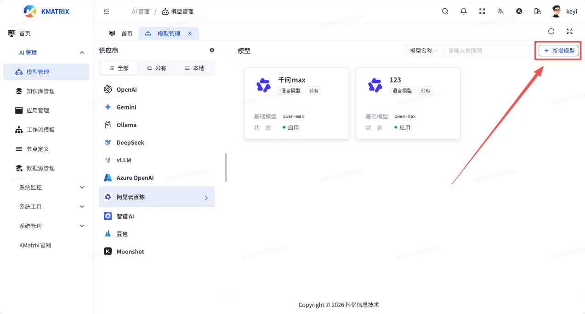
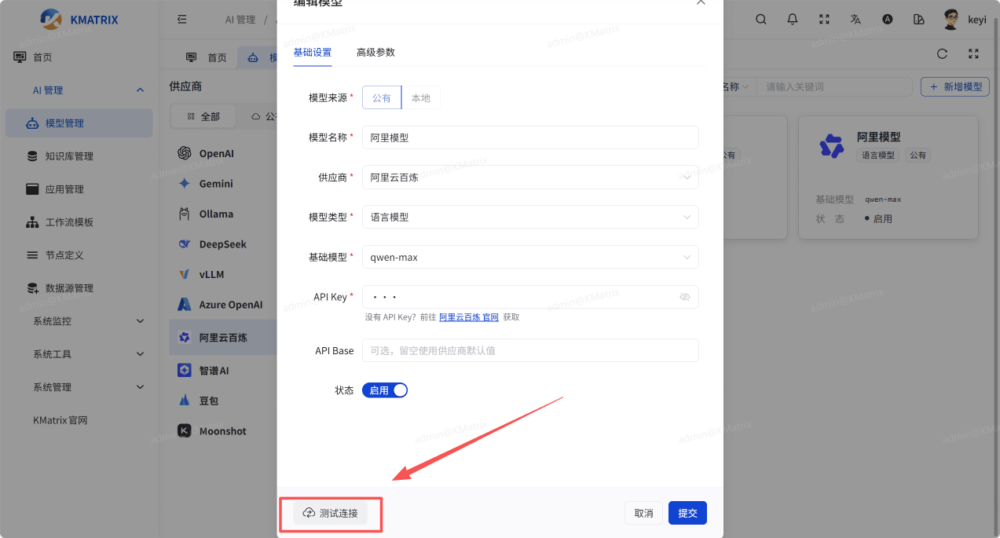
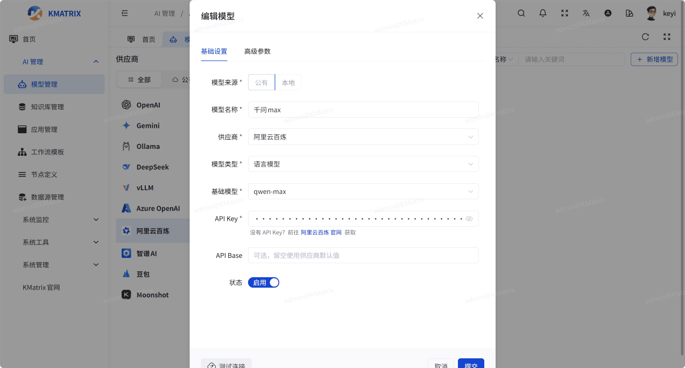
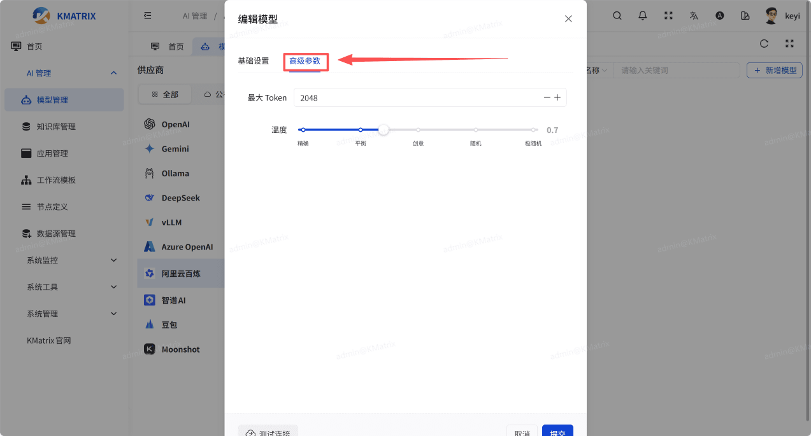
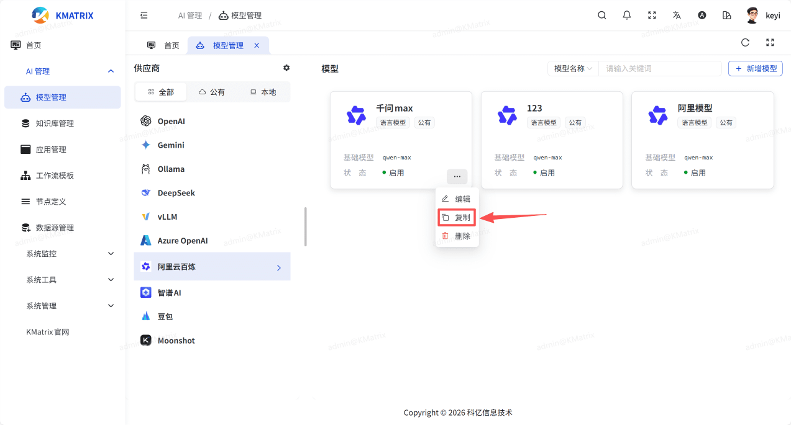
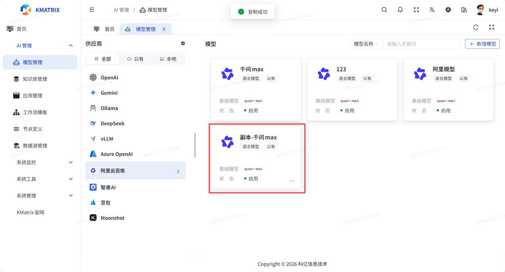

# 模型管理
KMATRIX 支持多种供应商的主流大模型。包括但不限于本地部署的私有模型如 Llama 3 ，国内提供的公共模型服务例如 阿里云百炼、DeepSeek、智谱 AI、豆包等，以及国际知名的公共模型服务如 OpenAI、Gemini Azure OpenAI等。集成的模型类型广泛，涵盖文本生成、向量分析、排序算法、语音识别、语音合成、计算机视觉模型以及图像生成等，满足多样化的业务需求和应用场景。
## 1.添加模型
点击添加模型并填写模型供应商，API Key， 模型名称后等详细信息用于添加模型

设置完成后可测试模型是否连接成功

## 2.基础设置
选择对应的模型供应商已添加的模型，选择编辑可以管理已添加的模型API Key，模型名称，模型类型等详细数据

## 3.高级参数
编辑模型页面下选择高级参数，可以调整温度，Max Token等参数

## 4.复制模型
选择复制模型可复制一份当前模型的副本

