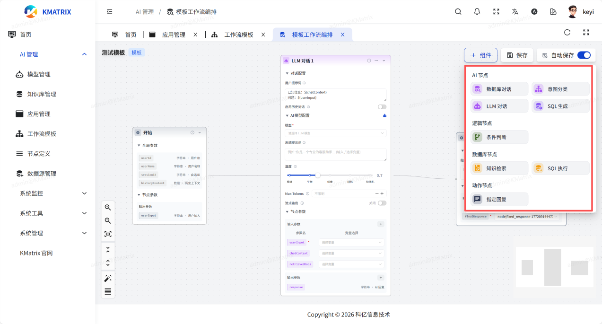
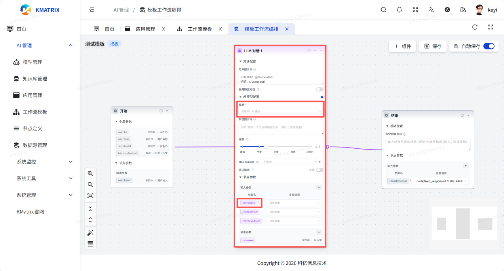
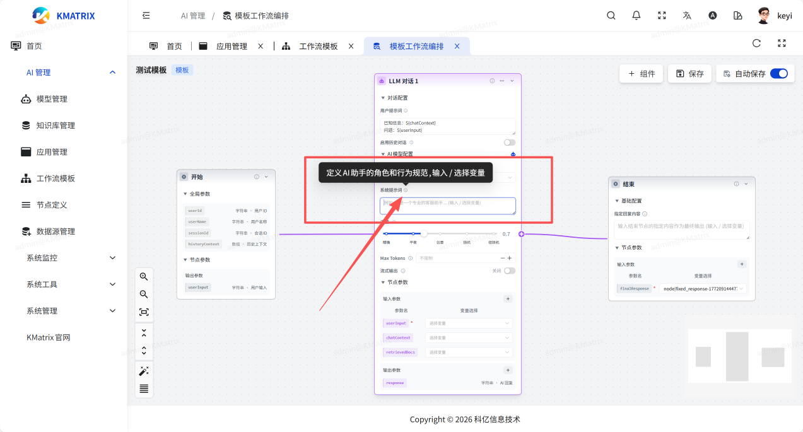
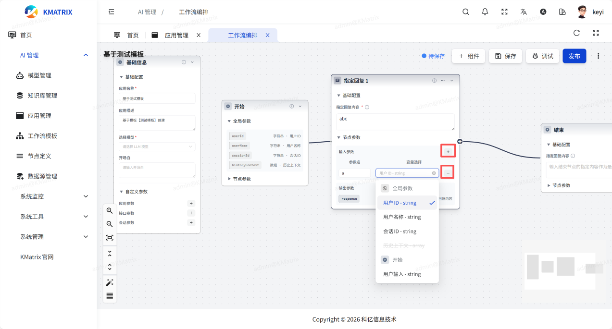
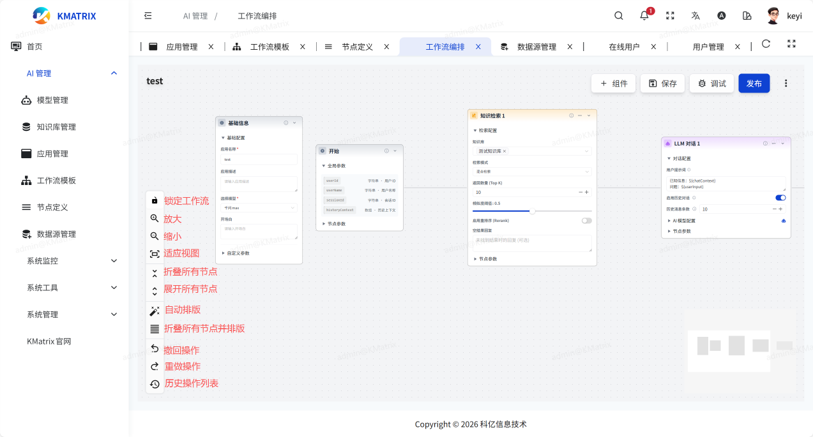

# 工作流编排
系统自带多个组件节点，直接添加并通过拖拽、连线的方式即可完成工作流编排

## 1.节点设置
以LLM对话节点为例，节点存在必填参数与可选参数，必填参数空缺将无法发布，发布时自动检查

可选参数填写与否不影响应用的正常使用，可根据需求填写，参数旁会有提示告知该参数的用途

## 2.节点参数的添加/删除
若需要更多的节点参数可自行添加/删除

## 3.工作流视图操作
左侧操作栏可对工作流视图进行操作

