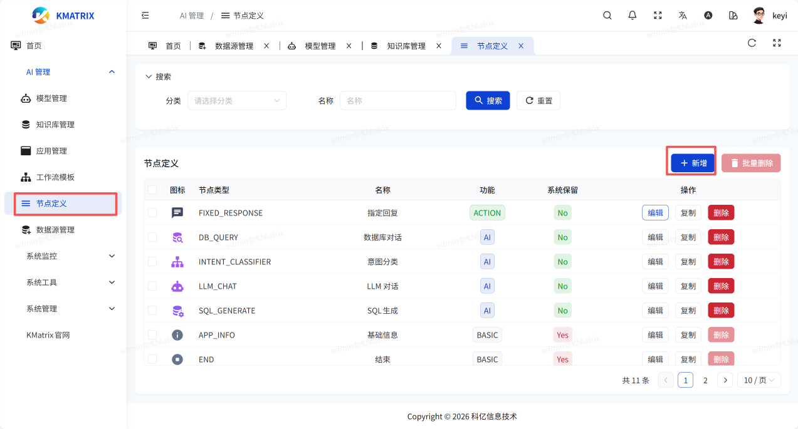
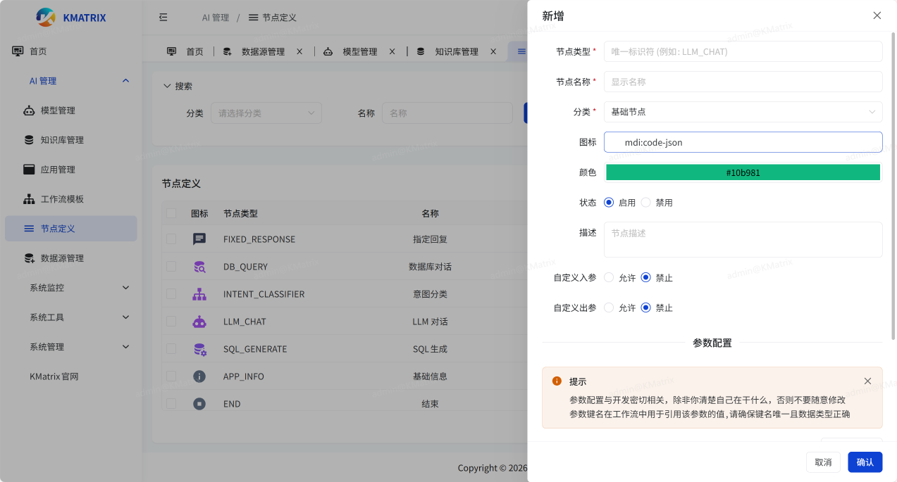
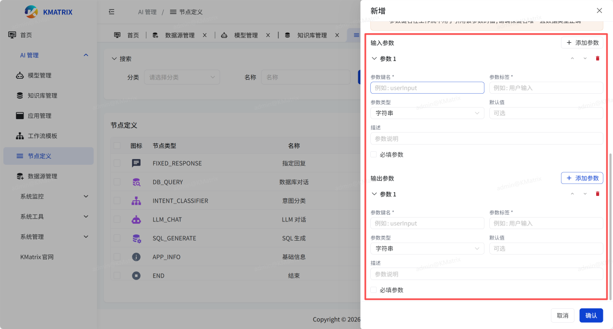
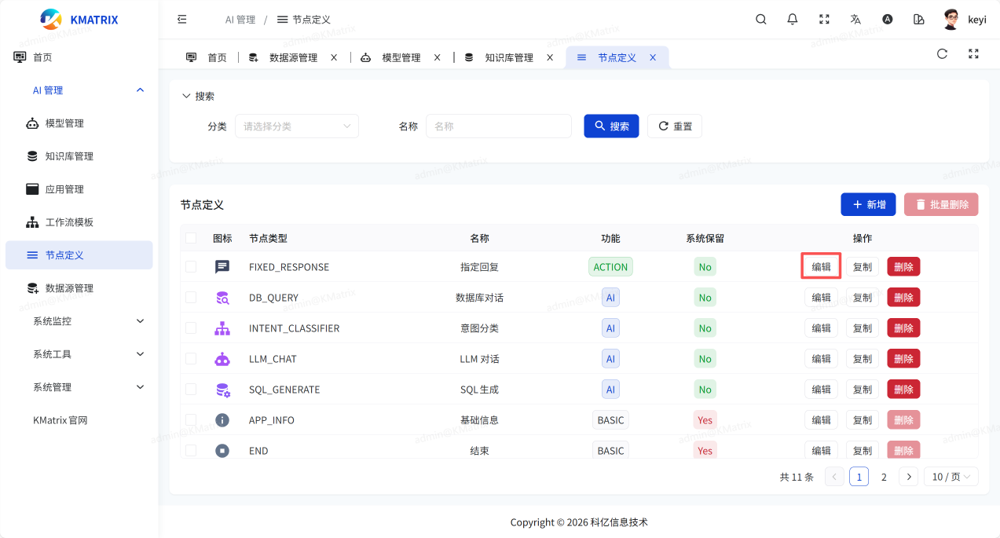
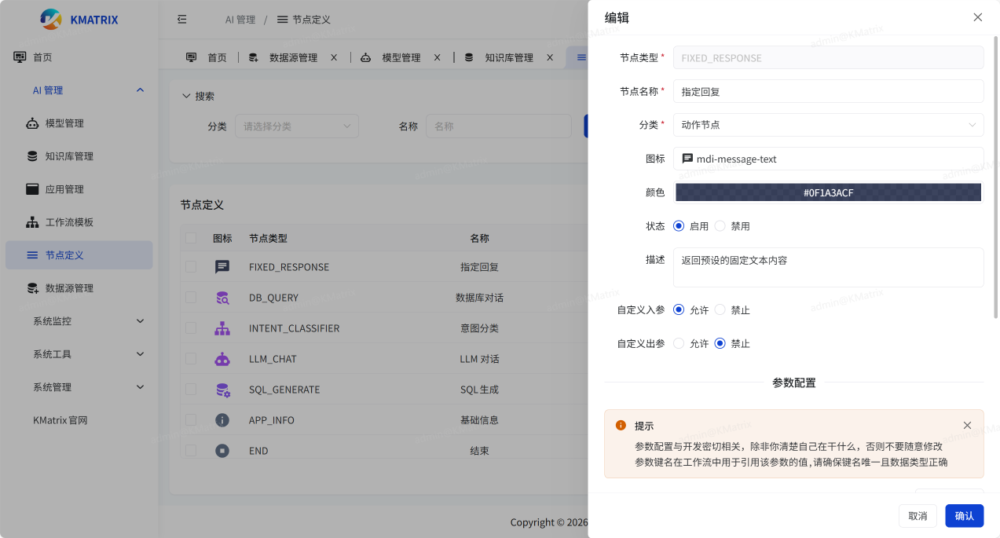

# 节点定义

【节点的修改与开发密切相关，除非你清楚自己在干什么，否则不要随意修改】

## 1.添加
点击【节点定义】->新增即可新增节点

## 2.节点参数

【参数配置与开发密切相关，除非你清楚自己在干什么，否则不要随意修改
参数键名在工作流中用于引用该参数的值，请确保键名唯一且数据类型正确】

可自行定义添加的节点的输入输出参数，以及是否必填

## 3.编辑节点
可修改每个节点的参数

【参数配置与开发密切相关，除非你清楚自己在干什么，否则不要随意修改
参数键名在工作流中用于引用该参数的值，请确保键名唯一且数据类型正确】

