# 应用管理
## 1.新建应用
- **什么是应用？**
**应用就是基于特定知识库、特定AI流程，发布后可嵌入第三方的话题窗口**。
比如这样的
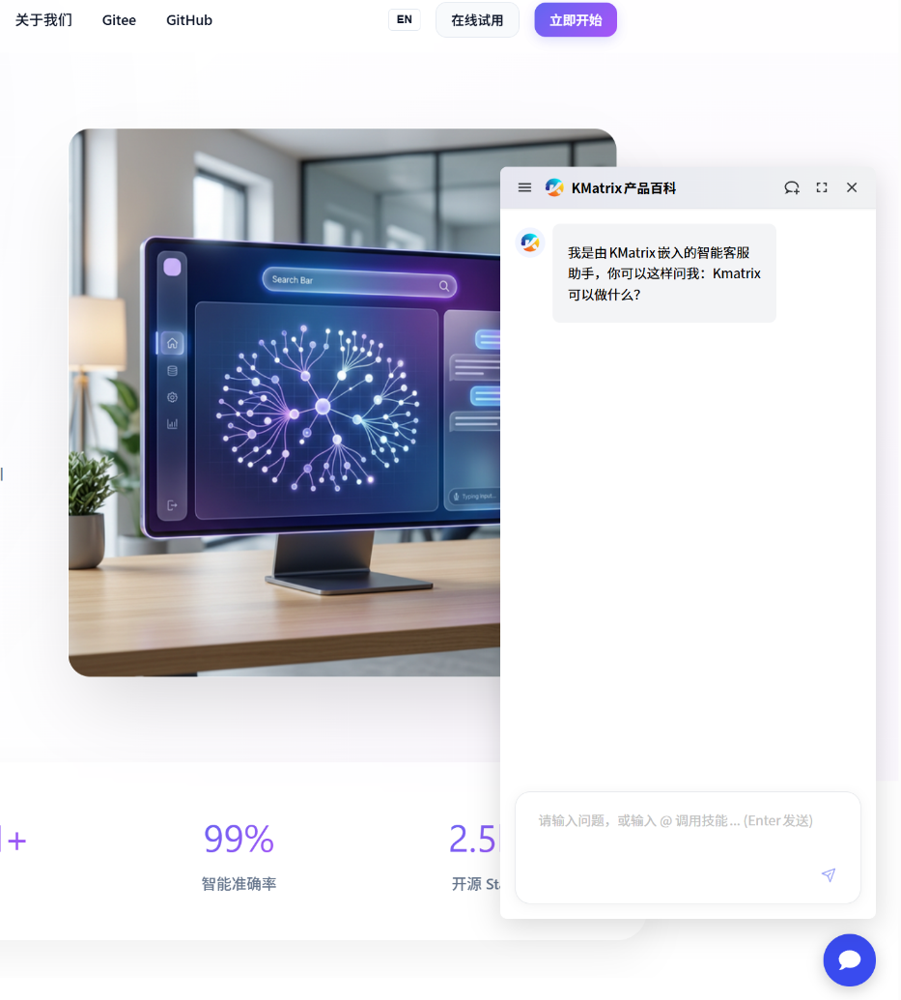
点击新建应用即可通过新建应用。创建应用的方式有两种，一是“自定义工作流”，即从零开始打造工作流；二是基于预定义模板，可以利用现有的工作流，并且可以二次开发。
- **自定义工作流**
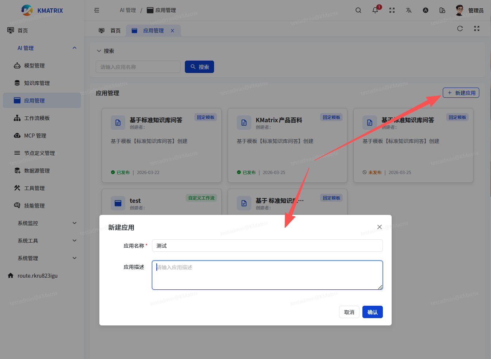
- **基于模板创建：**
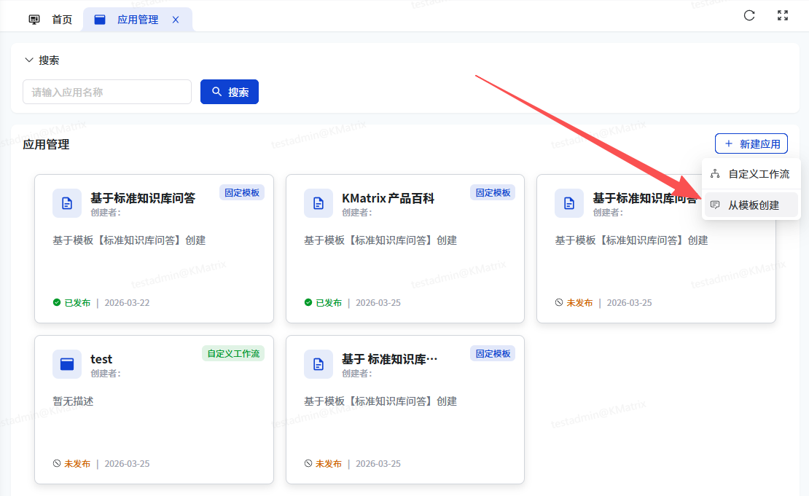
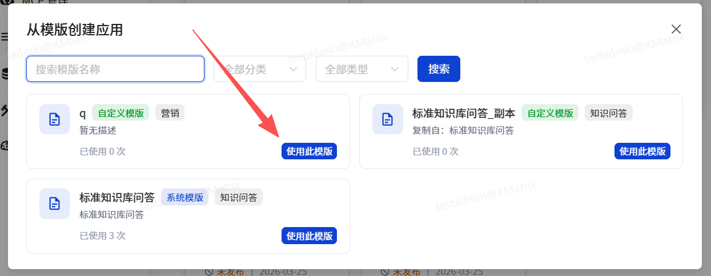
## 2.自定义工作流
工作流提供了LLM对话，数据库对话，意图分析等节点，用户可根据具体业务需求自行添加节点，并通过拖拽、连接的方式简单明了的构建自定义的工作流
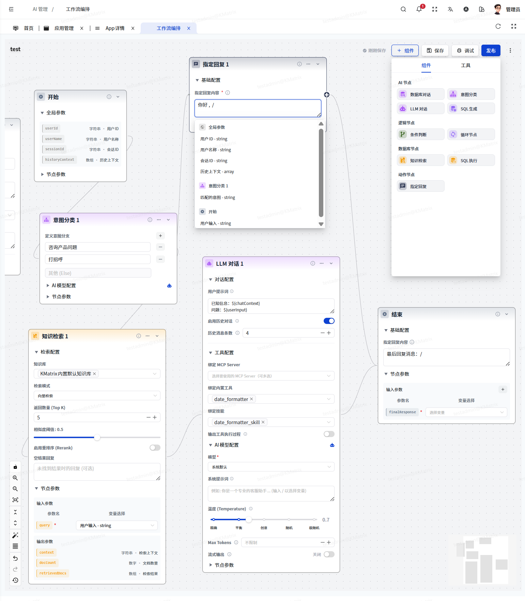
## 3.调试
工作流构建完成后可直接通过调试功能测试应用，调试功能下可看到各个节点的执行情况以及相应变量数据
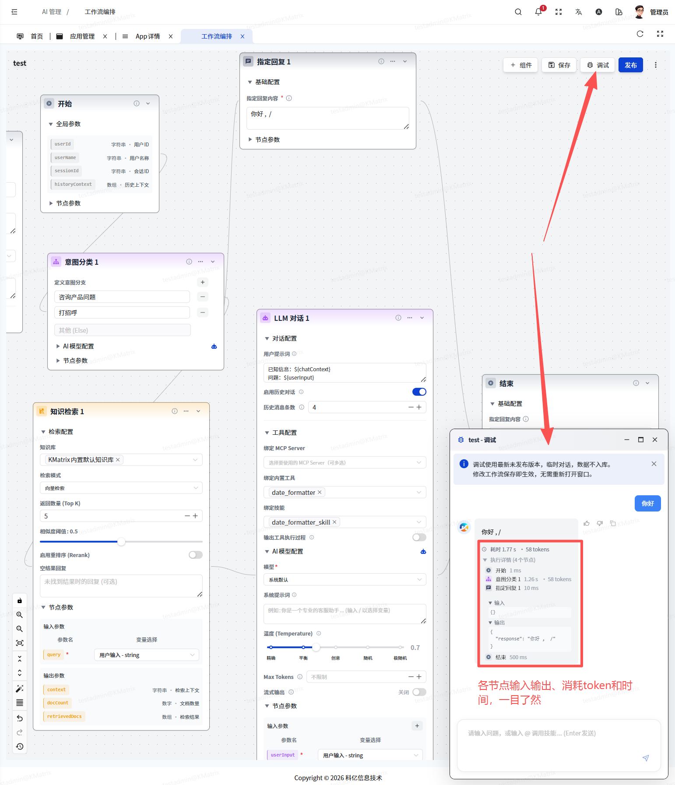
## 4.发布
应用调试无误后可执行发布，发布后即可嵌入第三方，提供正式的`客服咨询、销售对话`等功能
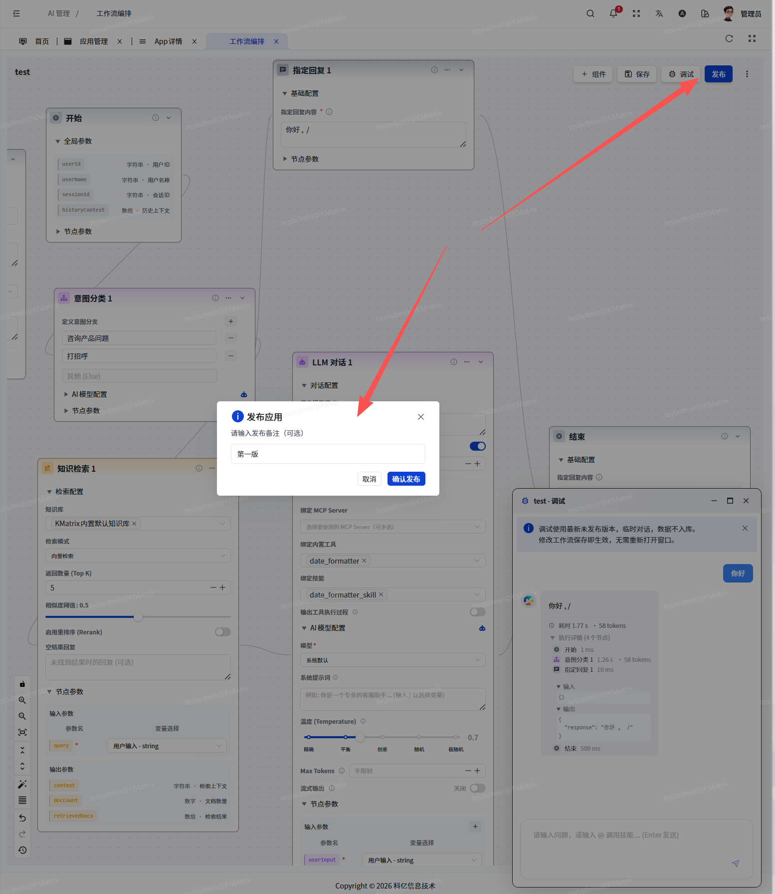
## 5. 去对话
### 5.1. 对话入口
应用发布后，就可以去进行实战对话，观察即将发布的应用嵌入第三方系统的对话效果
入口1 - 从应用列表，点击已发布的应用右下角菜单
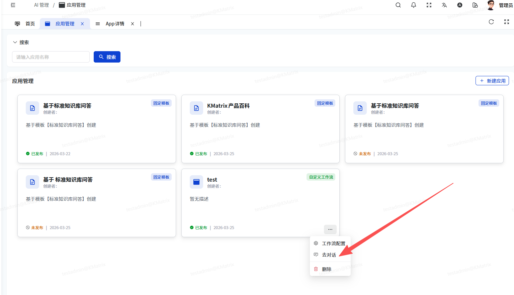
或者
点击应用卡片，进入应用详情页，从“部署运行”菜单下的“去对话”选项进入
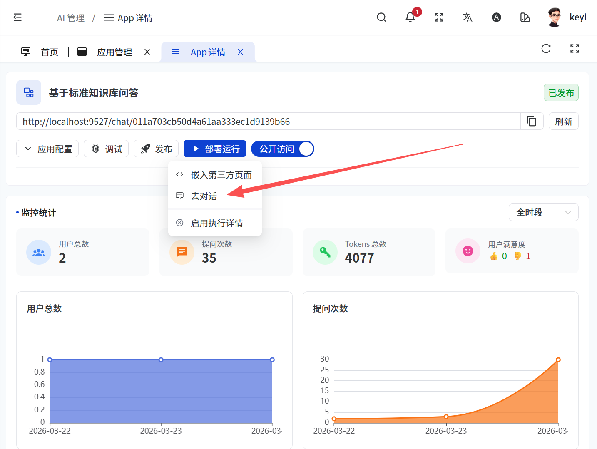
### 5.2. 对话
- **基本对话**
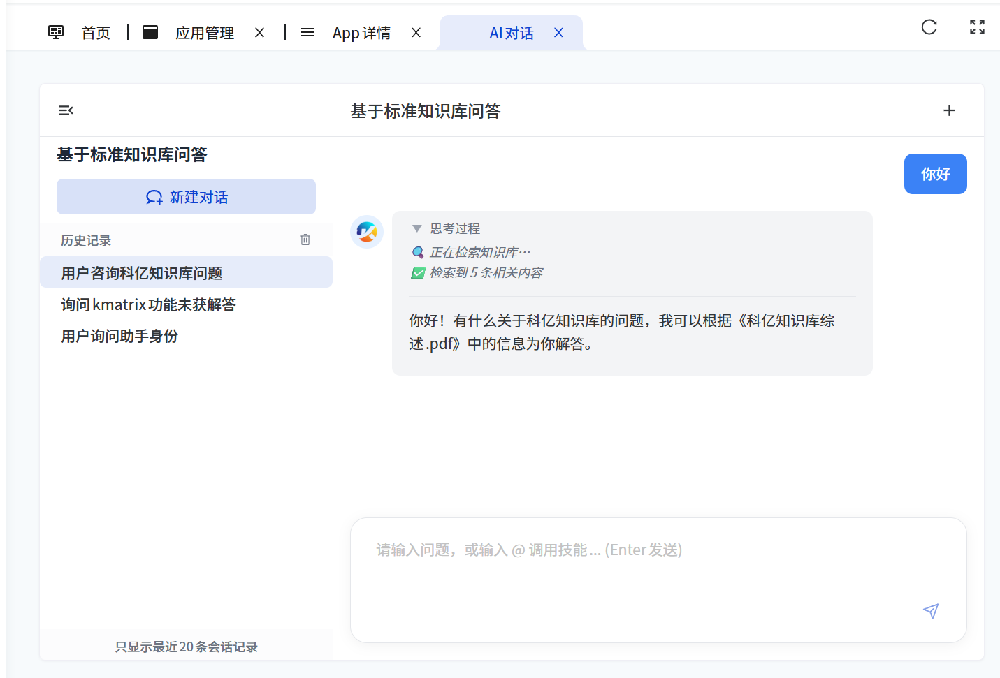
- **技能支持**
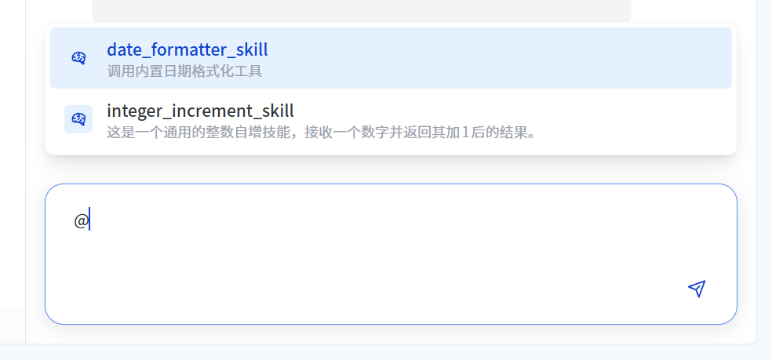
