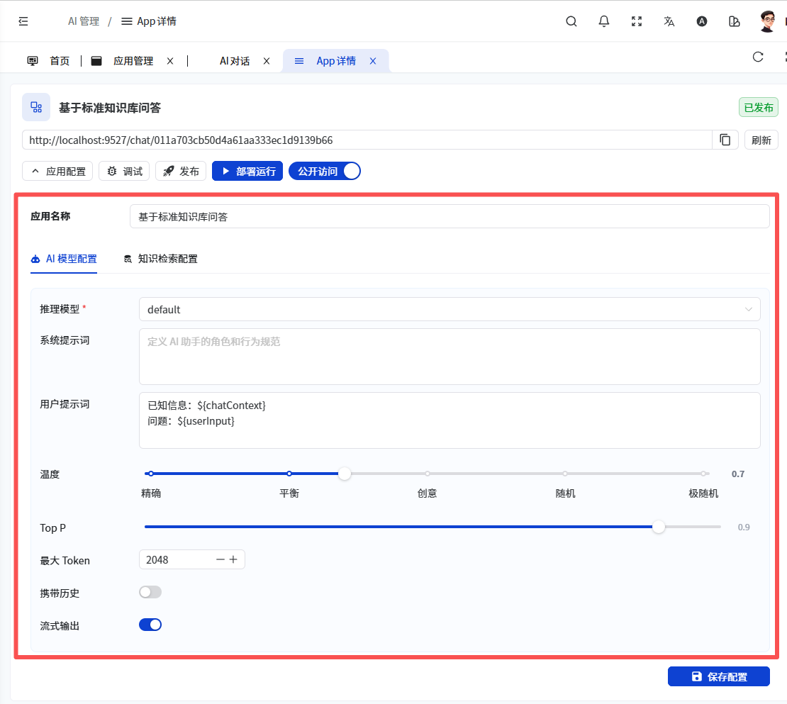
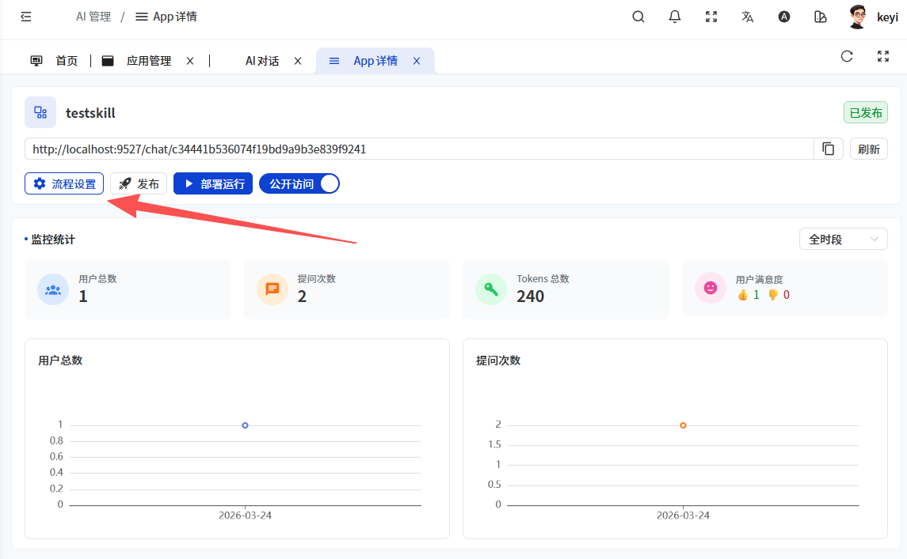
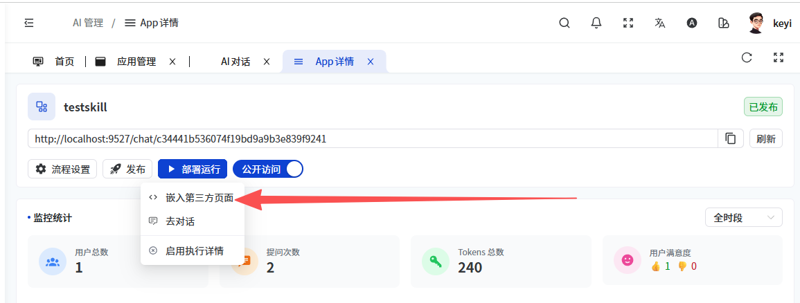
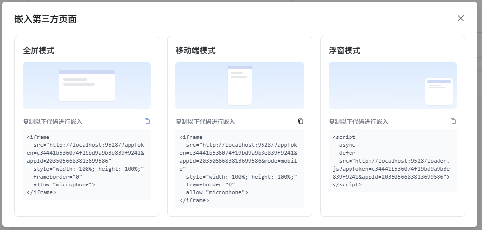
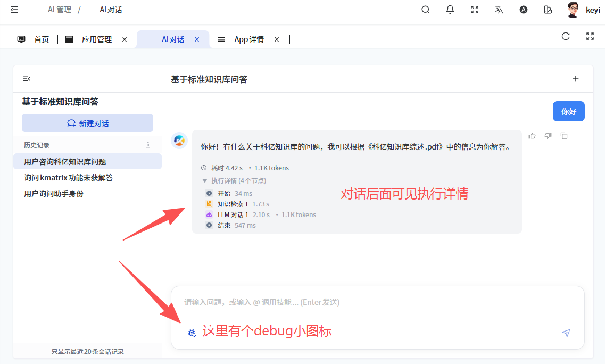
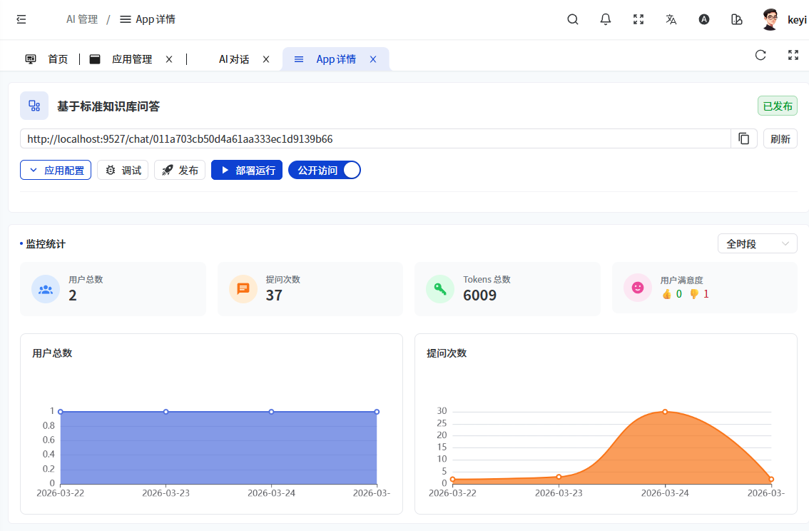

# 应用概览
创建完应用，进入APP详情可以查看APP的运行数据，进行各种配置
## 1.流程设置
#### 1.1 固定模板应用
从系统内置固定流程模板创建的应用，只需要进行简单的表单配置，无需进行复杂的工作流编排

#### 1.2 自定义工作流配置
从“流程设置”入口，进入工作流编排画布页面

## 2.应用部署运行
#### 2.1 嵌入第三方
KMatrix应用支持零编码嵌入到企业的第三方系统，在应用详情页面点击【运行】->【嵌入第三方】，复制全屏模式、移动端模式或浮窗模式代码嵌入到第三方系统中，即可在第三方系统中进行问答

#### 2.2 去对话
在应用发布状态下，可以直接开启对话窗口，在后台管理的角度观察嵌入第三方对话的效果（如前面章节描述）
#### 2.3 启用执行详情
如打开此选项，可以在发布状态下，在对话的过程中，同时返回执行详情，类似调试的效果。此功能需要管理员权限。

## 3.监控统计
APP详情页面下可直接监控该应用的用户数量，提问次数，Tokens总数等信息

