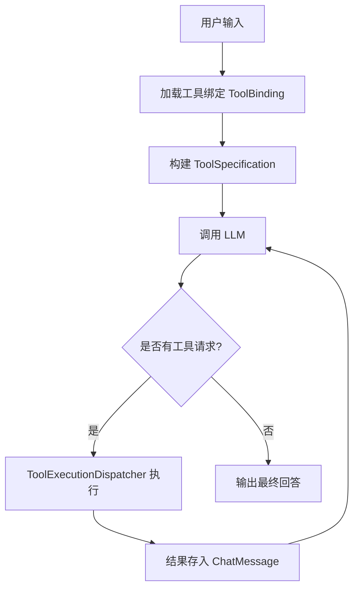

## 核心机制

KMatrix 的工具调用机制是基于 **LangChain4j** 框架实现的。当用户在对话中启用某些“技能”（Skills）或“工具”（Tools）时，系统会按照以下流程运行：

### 1. 工具的定义与发现
系统通过扫描带有 `@Tool` 注解的方法，或加载数据库中定义的 `ToolBinding`，将工具的元数据（名称、描述、入参规范）提取出来，构建成 `ToolSpecification`。

### 2. 工具绑定的解析
在发起对话请求前，`AiService` 会根据当前对话选中的技能，动态注入这些 `ToolSpecification` 到大模型的请求体中。

### 3. “大模型 - 工具” 交互循环
KMatrix 支持标准的工具调用循环：
1.  **模型决策**：LLM 收到用户输入和工具列表，决定是否需要调用工具。
2.  **提取请求**：如果模型决定调用，它会返回一个 `ToolExecutionRequest`。
3.  **回退解析 (Fallback)**：针对某些不按常理出牌的模型，KMatrix 实现了 `parseFallbackToolRequests`。如果模型在正文中输出了符合特定 JSON 格式的内容，系统也能将其识别为工具调用。
4.  **分发执行**：通过 `ToolExecutionDispatcher.dispatchForResult` 查找对应的工具实例并执行。
5.  **反馈结果**：将工具执行的结果封装为 `ToolExecutionResultMessage` 放入对话上下文，再次调用 LLM，直到模型决定给出最终答复。

### 4. 工具执行分发 (Dispatcher)
`ToolExecutionDispatcher` 是执行的中枢，它负责：
*   根据模型请求的 `name` 匹配已加载的 `ToolBinding`。
*   处理参数注入（将 JSON 参数反序列化为执行所需的格式）。
*   支持 **富媒体结果**：工具不仅可以返回文本，还可以返回图片（`ImageContent`）等内容，系统会自动处理并反馈给模型。

### 5. 实时追踪 (Tool Trace)
为了优化用户体验，KMatrix 引入了工具追踪机制：
*   当开启 `enableToolTrace` 时，后端会通过 **SSE (Server-Sent Events)** 实时向前端发送 `TOOL_TRACE` 事件。
*   用户可以在 UI 界面上实时看到模型正在调用哪个工具、参数是什么、以及工具返回的原始结果，增加了 AI 思考过程的透明度。

### 6. 特色：模型兼容性增强
KMatrix 特别强化了对非标准模型（或国产模型）的兼容性。即使模型厂商的 API 对 LangChain4j 的 Native Tool Calling 支持不佳，KMatrix 也能通过正则提取和文本解析确保存接成功。

**总结流程图：**

## Built-in Tools (内置工具)

在 KMatrix 中，如果一个 **Skill (技能)** 绑定了多个 **Built-in Tools (内置工具)**，目前的处理机制如下：

### 1. 表现形式：对外是一个整体
对大模型（LLM）而言，它并不知道这个 Skill 背后绑定了多少个工具。Skill 被包装成了一个 **单一的函数**。大模型只看到 Skill 的名称、描述以及你在 Skill 定义中填写的 `inputSchema`（入参规范）。

### 2. 核心决定机制：顺序执行 (Sequential Execution)
目前的实现逻辑是 ***“不选，全都要”***。当大模型发起对该 Skill 的调用时，KMatrix 的 `SkillOrchestrationService` 会按照你在 Skill 中绑定的顺序，**依次执行该技能下所有的内置工具**。

具体的代码逻辑（参考 `SkillOrchestrationService.java`）如下：
*   **循环调用**：系统会遍历该 Skill 绑定的所有 `innerBindings`。
*   **结果汇总**：每个工具都会收到相同的请求参数（`request`）。系统会收集每个工具返回的执行结果，并将它们拼接成一个汇总字符串。
*   **统一反馈**：将所有工具的结果（包含成功或失败的信息）一次性返回给大模型。

### 3. 为什么这样设计？
这种“编排”模式（Skill Orchestration）通常用于将一系列相关的原子操作组合成一个高级任务。例如：
*   **Skill：查询并发送周报**
    *   工具 1：`get_weekly_report` (从数据库取数据)
    *   工具 2：`send_email` (发送邮件)
*   模型只需要调用一次这个 Skill，后端就会自动完成“取数据 -> 发邮件”的链路，并将两个步骤的结果反馈给模型。

### 4. 补充说明
虽然目前是 **顺序执行 (Sequential)**，但在代码结构中已经预留了 `ExecutionMode`（执行模式）的枚举，这意味着未来可能会支持更多的调度策略，例如：
*   **并行执行 (Parallel)**：同时启动所有绑定的工具，缩短响应时间。
*   **路由/条件执行 (Routing)**：根据参数或逻辑判断，决定只执行其中的某几个工具。

**总结**：在当前的 KMatrix 版本中，只要大模型调用了这个 Skill，它下面绑定的所有内置工具都会被 **按顺序全部执行一遍**，结果会被汇总后返回给模型。
