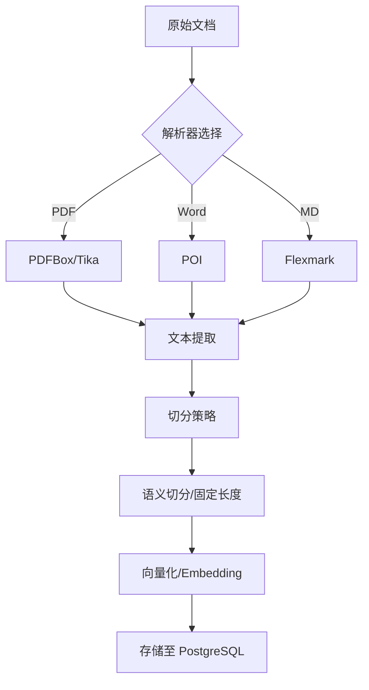

# 文档处理框架

KMatrix 提供了一个稳健的文档处理流水线，负责从原始文件提取、切分到向量化的全过程。

```mermaid
graph TD
    A[原始文档] --> B{解析器选择}
    B -- PDF --> C[PDFBox/Tika]
    B -- Word --> D[POI]
    B -- MD --> E[Flexmark]
    C --> F[文本提取]
    D --> F
    E --> F
    F --> G[切分策略]
    G --> H[语义切分/固定长度]
    H --> I[向量化/Embedding]
    I --> J[存储至 PostgreSQL]
```

## 核心特性
- **并发处理**: 支持多文件并行解析。
- **自定义切分**: 用户可以根据文档类型选择不同的切分参数。
- **错误重试**: 针对解析失败的文件提供自动重试机制。
