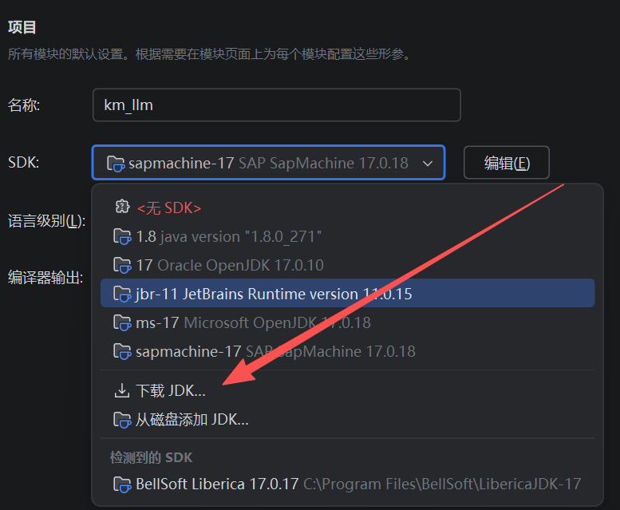
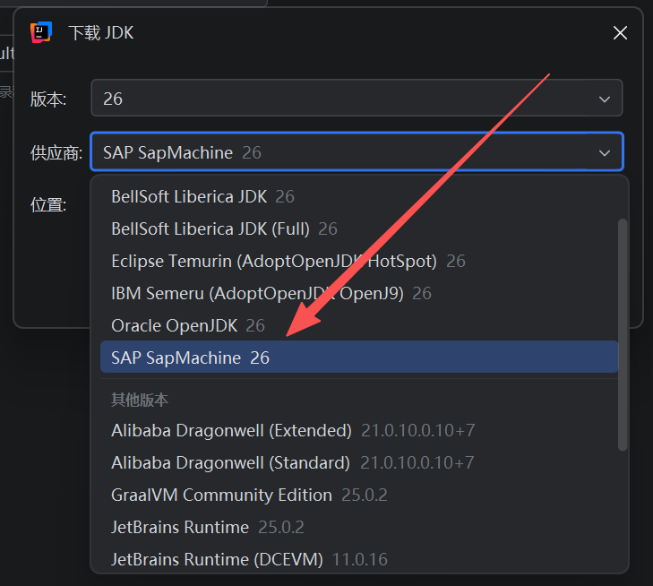

#### 在 Spring Boot 开发中，针对 IntelliJ IDEA 和 VS Code 都能通用的热加载方案主要有以下三种：

1. 环境准备：安装支持 DCEVM 的 JDK
传统的 Oracle JDK 或 OpenJDK 不支持这种高级热替换，你需要安装一个集成了 DCEVM 的 JDK。

推荐选择：SapMachine (由 SAP 维护，自带 DCEVM)。
下载对应的版本（如 SapMachine 17 或 21），选择 JDK 并在安装/解压后将其设为项目的 SDK。

备选方案：如果你使用的是 IntelliJ IDEA，它自带的 JetBrains Runtime (JBR) 实际上也包含了 DCEVM 的部分功能，但对于 VS Code 兼容性较差，建议还是安装独立的 SapMachine。

如果是IDEA，可以做编辑器直接选择下载：

2. 获取 HotswapAgent
这是一个 Java Agent，负责处理框架层的“刷新”逻辑。
从 HotswapAgent GitHub Releases 下载最新的 hotswap-agent.jar。
将其放在一个固定的目录（例如 D:/tools/hotswap-agent.jar）。

3. 在 IntelliJ IDEA 中配置
IDEA 对热加载的支持比较零散，需要几个地方配合：
设置 VM 参数：
在你的 Spring Boot 运行配置（Run/Debug Configuration）中，找到 VM Options，添加：
`-javaagent:\"D:\\software\\hotswap-agent-2.0.3.jar\"=autoHotswap=true`
`--add-opens java.base/java.lang=ALL-UNNAMED`
`--add-opens java.base/java.lang.reflect=ALL-UNNAMED`
`--add-opens java.base/java.io=ALL-UNNAMED`
`--add-opens java.base/java.util=ALL-UNNAMED`
`--add-opens java.base/java.security=ALL-UNNAMED`
`--add-opens java.base/sun.net.www.protocol.jar=ALL-UNNAMED`
`--add-opens java.desktop/sun.awt=ALL-UNNAMED`

开启自动编译：
Settings -> Build, Execution, Deployment -> Compiler -> 勾选 Build project automatically。
允许运行时编译：
Settings -> Advanced Settings -> 勾选 Allow auto-make to start even if developed application is currently running。
Debugger 设置：
Settings -> Build, Execution, Deployment -> Debugger -> HotSwap。
将 On 'Reload classes after compilation' 设为 Always。

4. 在 VS Code 中配置
VS Code 主要依赖 launch.json 来控制启动行为：
\"vmArgs\": \"-javaagent:/path/to/hotswap-agent.jar=autoHotswap=true\"
