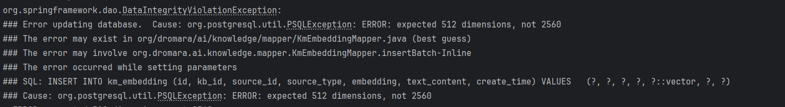
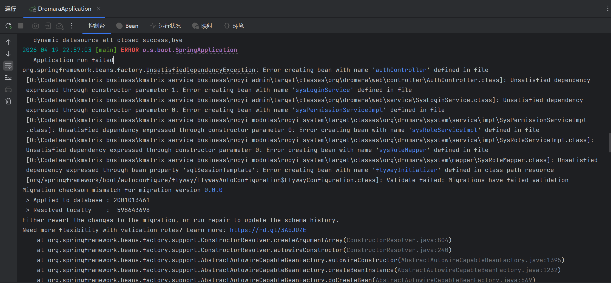

- # 公用向量模型的维度不匹配512
常见错误如图

系统内预定义的向量化维度是512（性能平衡），系统内置的向量化模型ONNX BGE-Reranker，也是以512为维度。
部分共用向量化模型，支持多种嵌入维度 —— [2048、1024、512、256] —— 即使在较低维度下性能下降也较小。需要归一化后使用。（如 OpenAI 的 text-embedding-3 系列或部分开源模型）支持 Matryoshka Representation Learning。这允许你直接截断向量而保留大部分语义信息。

**操作**：

- 在调用 API 时，检查模型是否支持 dimensions 参数。如果支持，直接请求 512 维的输出。

- 手动截断： 如果模型支持此特性，你可以直接取向量的前 512 位并进行 L2 归一化（L2 Normalization）。

**注意**： 并非所有模型都支持直接截断，普通模型直接截断会导致语义信息严重丢失。

- # flyway版本匹配错误
常见错误如图

**原因**
KMatrix采用flyway来管理初始化的增量脚本（位于ruoyi-admin/src/main/resources/db/migration/）,原则上，一旦sql确定并且执行，就不允许修改，否则就报错。但有时候，一些微小改动不值得增加一个版本，就违背了这个原则而手工调整历史的增量脚本。
这种情况，很少发生，也是可以解决的。

**解决方案**
有两个解决方案，如果是测试开发阶段，最简单就是方案1，无脑重建新的库就行。

1. 重新初始化，提供一个全新的空的数据库，让脚本从0开始跑，就没有版本冲突的问题。
2. 在yml配置文件把配置项spring.flyway.repair-on-migrate改为：true，自动忽略历史执行记录。这样会跳过执行新版本的sql，为了同步数据库，就必须把跳过的sql手工执行一遍。幸运的是，增量sql脚本都考虑了幂等，可以重复执行。
